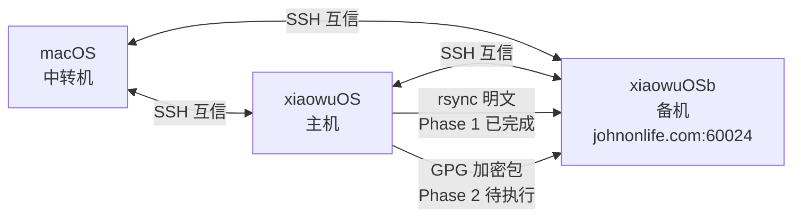
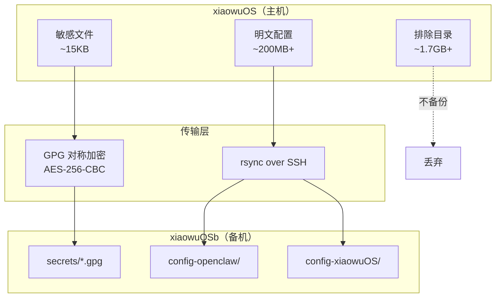
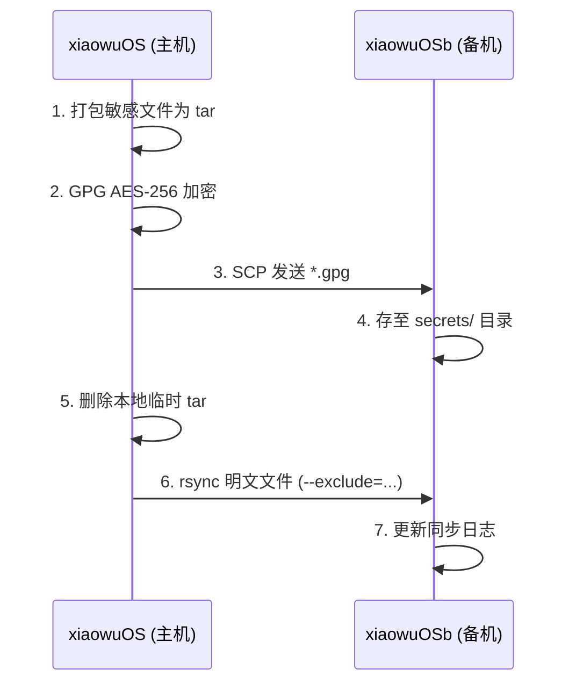
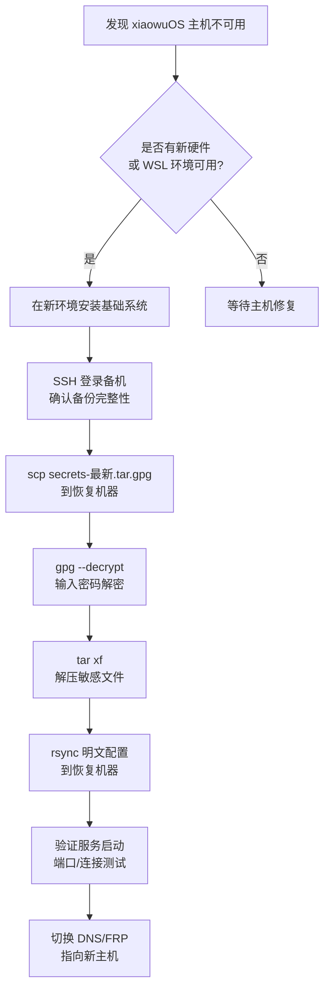

# xiaowuOS V0.1 备份架构说明

> **版本:** V0.1（Phase 2 加密备份设计）  
> **日期:** 2026-06-15  
> **状态:** 设计方案（待澄木老师确认后执行）  
> **适用范围:** xiaowuOS 主机 → xiaowuOSb 备机

---

## 目录

1. [概述](#一概述)
2. [Phase 1 完成记录](#二phase-1-完成记录)
3. [敏感目录盘点](#三敏感目录盘点)
4. [备份架构设计](#四备份架构设计)
5. [加密方案详述](#五加密方案详述)
6. [文件清单](#六文件清单)
7. [RTO / RPO 定义](#七rto--rpo-定义)
8. [灾难恢复流程](#八灾难恢复流程)
9. [灾难恢复演练计划](#九灾难恢复演练计划)
10. [风险矩阵与缓解措施](#十风险矩阵与缓解措施)
11. [下一步行动](#十一下一步行动)

---

## 一、概述

本文档描述 xiaowuOS 系统从主机到备机（xiaowuOSb）的备份架构，覆盖：

- **Phase 1：** 普通目录同步（已完成 ✅）
- **Phase 2：** 敏感配置加密备份设计（待确认 ⏳）
- **Phase 3：** 自动化 cron + 轮转策略（规划中 🔜）

### 系统拓扑



---

## 二、Phase 1 完成记录

| 项目 | 状态 | 备注 |
|------|------|------|
| SSH 三机互信 | ✅ | macOS ↔ xiaowuOS、macOS ↔ xiaowuOSb、xiaowuOS ↔ xiaowuOSb |
| xiaowuOSb FRP 端口 | ✅ | johnonlife.com:60024 |
| 备机目录创建 | ✅ | `~/xiaowuOS_standby/xiaowuOS/` |
| rsync dry-run | ✅ | Exit 0，总大小 6.5MB |
| 实际同步 | ✅ | `/home/john/xiaowuOS` → 约 5.4MB |
| `--delete` 使用 | ❌ | 未使用（只追加不覆盖策略） |
| 敏感 JSON 混入检查 | ✅ | 未发现明显泄露 |

---

## 三、敏感目录盘点

### `.openclaw/`（总计 ~2GB，核心配置 ~46KB）

| 分类 | 路径 | 大小 | 说明 |
|------|------|------|------|
| 🔴 **高度敏感** | `openclaw.json` | 8 KB | Bot token + API keys |
| 🔴 **高度敏感** | `credentials/*` | ~24 KB | 设备配对记录 |
| 🔴 **高度敏感** | `identity/device-auth.json` | 12 KB | 设备认证信息 |
| ⚪ **可明文** | `agents/main/` | 189 MB | Agent 配置 |
| ⚪ **可明文** | `workspace/` | 1.3 MB | 工作区文档 |
| ⚪ **可明文** | `cron/tasks/flows/` | — | Cron 任务与工作流 |
| ⚪ **可明文** | `plugin-skills/` | — | 插件技能 |
| ❌ **排除** | `npm/` | 1.4 GB | Node 模块，可从 registry 恢复 |
| ❌ **排除** | `tools/` | 292 MB | 可重新安装的工具链 |
| ❌ **排除** | `cache/`, `subagents/` | — | 临时文件，可再生 |

### `.xiaowuOS/`

| 分类 | 路径 | 说明 |
|------|------|------|
| 🔴 **高度敏感** | `.env`, `feishu.env`, `aizzz.env` | Proxy / API Key / 密钥 |
| 🔴 **高度敏感** | `config/private/*` | 完整备份副本 + 配对信息 |
| ⚪ **可明文** | `docs/` | 课件 / SOP / PPT |
| ⚪ **可明文** | Python 脚本、`bin/`, `data/` | 代码与数据 |
| ⚪ **可明文** | `config/models.yaml`, `xiaowu_agents_models.json` | 模型配置 |
| ❌ **排除** | `__pycache__/`, git bundle, 旧备份文件 | 可再生或冗余 |

---

## 四、备份架构设计

### 4.1 总体架构



### 4.2 ASCII 架构总览

```
xiaowuOS (主机)                               xiaowuOSb (备机)
┌──────────────────────────┐         ┌─────────────────────────────┐
│                          │   SSH   │                             │
│  🔒 secrets-YYYYMMDD.tar│ ──────→ │ ~/xiaowuOS_standby/         │
│      .gpg                │        │    ├── secrets/*.gpg          │
│                          │        │    ├── config-openclaw/       │
│  📦 rsync --exclude=...  │ ────→  │    │   ├── workspace/         │
│     (明文配置)            │        │    │   ├── agents/main/       │
│                          │        │    │   └── cron-tasks/        │
│  ⏭️  排除: npm/, tools/   │        │    ├── config-xiaowuOS/       │
│     cache/, __pycache__/  │        │    │   ├── docs/              │
└──────────────────────────┘         │    │   ├── bin/               │
                                    │    │   └── models.yaml        │
                                    │    └── CHANGELOG.md           │
                                    └─────────────────────────────┘
```

### 4.3 设计原则

| # | 原则 | 说明 |
|---|------|------|
| 1 | **敏感分离** | 密钥类文件单独打包 + GPG 对称加密（AES-256） |
| 2 | **明文直传** | 非敏感文件通过 rsync 直接同步 |
| 3 | **零存储密码** | GPG 密码不写入任何文件，由澄木老师口头掌握 |
| 4 | **只追加不覆盖** | 不使用 `--delete`，历史备份可追溯 |
| 5 | **每日一次** | 初始频率暂定每日一次，Phase 3 将通过 cron 自动化 |

---

## 五、加密方案详述

### 5.1 加密工具选择

| 项目 | 选型 | 理由 |
|------|------|------|
| 算法 | AES-256-CBC | 静态数据保护足够强度，双机间无需非对称 |
| 工具 | GPG (`gpg --symmetric`) | Linux/macOS 原生支持，生态成熟 |
| 密钥管理 | 口令密码（passphrase） | 由澄木老师口头掌握，不落地存储 |

### 5.2 加密包内容（`secrets-YYYYMMDD.tar.gpg`）

```bash
tar cf - \
  .openclaw/openclaw.json \
  .openclaw/credentials/ \
  .openclaw/identity/device-auth.json \
  .xiaowuOS/.env \
  .xiaowuOS/feishu.env \
  .xiaowuOS/aizzz.env \
  .xiaowuOS/config/private/ \
| gpg --symmetric --cipher-algo AES256 \
      --compress-algo 1 \
      -o ~/xiaowuOS_standby/secrets/secrets-$(date +%Y%m%d).tar.gpg
```

### 5.3 明文同步清单（rsync）

| 源路径 | 目标目录 | 内容说明 |
|--------|----------|----------|
| `.openclaw/workspace/` | `config-openclaw/workspace/` | 工作区文档 |
| `.openclaw/agents/main/` | `config-openclaw/agents/main/` | Agent 配置 |
| `.openclaw/cron/, tasks/, flows/` | `config-openclaw/cron-tasks/` | Cron + 任务流 |
| `.xiaowuOS/docs/` | `config-xiaowuOS/docs/` | 课件 / SOP |
| `.xiaowuOS/config/models.yaml` | `config-xiaowuOS/config/models.yaml` | 模型配置 |
| `.xiaowuOS/xiaowu_agents_models.json` | `config-xiaowuOS/xiaowu_agents_models.json` | Agent 模型映射 |
| `.xiaowuOS/bin/, data/` | `config-xiaowuOS/bin/, data/` | 可执行脚本与数据 |

### 5.4 同步执行流程



---

## 六、文件清单

### 6.1 加密包（~15KB）

| 文件 | 大小 |
|------|------|
| `openclaw.json` | ~8.2 KB |
| `credentials/*` | ~24 KB |
| `device-auth.json` | ~12 KB |
| `.env`, `feishu.env`, `aizzz.env` | ~1 KB |
| `config/private/*` | ~3 KB |

### 6.2 明文同步（~200MB+）

- `workspace/` — 工作区文档
- `agents/main/` — Agent 核心配置（189 MB）
- `docs/` — 课件 / SOP / PPT
- `config/models.yaml`, `xiaowu_agents_models.json`
- `bin/`, `data/`

### 6.3 排除项（~1.7GB+）

| 目录 | 大小 | 排除原因 |
|------|------|----------|
| `npm/` | 1.4 GB | 可从 npm registry 重新安装 |
| `tools/` | 292 MB | 可重新安装 |
| `__pycache__/` | — | Python 编译缓存，可再生 |
| git bundle, 旧备份文件 | — | 冗余数据 |

---

## 七、RTO / RPO 定义

### 7.1 指标定义

| 指标 | 全称 | 中文含义 |
|------|------|----------|
| **RTO** | Recovery Time Objective | 从灾难发生到系统恢复可用所允许的**最大停机时间** |
| **RPO** | Recovery Point Objective | 允许丢失的**最大数据量**（以时间为单位衡量） |

### 7.2 当前备份方案指标

| 指标 | 目标值 | 说明 |
|------|--------|------|
| **RTO — 敏感配置恢复** | ≤ 30 分钟 | GPG 解密 + 文件还原，人工操作 |
| **RTO — 明文配置恢复** | ≤ 15 分钟 | rsync 增量同步几乎即时可用 |
| **RPO — 敏感配置** | ≤ 24 小时 | 每日一次加密备份 |
| **RPO — 明文配置** | ≤ 24 小时 | 每日一次 rsync 同步 |

### 7.3 Phase 3 目标（规划中）

| 指标 | 目标值 | 说明 |
|------|--------|------|
| RTO | ≤ 15 分钟 | 自动化恢复脚本，一键切换 |
| RPO | ≤ 1 小时 | cron 每 4~6 小时备份一次 |

---

## 八、灾难恢复流程

### 8.1 主机完全故障 — 从备机恢复



### 8.2 单文件误删 — 快速还原

```bash
# 在备机上定位备份
cd ~/xiaowuOS_standby/secrets/

# 解密最新加密包到临时目录
gpg --output /tmp/secrets-latest.tar \
    --decrypt secrets-$(date -d "yesterday" +%Y%m%d).tar.gpg

# 提取特定文件
tar xf /tmp/secrets-latest.tar -C /tmp/ --wildcards '*.env'

# SCP 回主机
scp /tmp/.env john@xiaowuOS:~/.xiaowuOS/
```

---

## 九、灾难恢复演练计划

### 9.1 演练总则

| 项目 | 内容 |
|------|------|
| **频率** | 每季度一次（建议 Q3 2026-07, Q4 2026-10） |
| **参与人** | 澄木老师（密码持有人）、技术实施人 |
| **目标** | 验证备份可解密、文件完整、恢复流程可行 |
| **原则** | 使用测试环境或临时目录，不影响生产数据 |

### 9.2 演练清单

#### 第一次演练（建议：Phase 2 确认后一周内）

| 步骤 | 操作 | 预期结果 | 检查人 |
|------|------|----------|--------|
| 1 | 确认 GPG 密码 | 澄木老师提供，能正常解密 | ✅ |
| 2 | 在备机临时目录解密 `secrets-YYYYMMDD.tar.gpg` | `.openclaw/openclaw.json` 等文件完整出现 | 📋 |
| 3 | 检查解密后文件权限 | 应为 `600` 或 `400` | 📋 |
| 4 | 比对敏感文件 MD5 / SHA256 与主机一致 | Hash 匹配 | 📋 |
| 5 | 模拟 rsync 恢复到临时目录 | 明文配置完整，无遗漏 | 📋 |
| 6 | 清理演练产生的临时文件 | `/tmp/` 恢复干净 | 📋 |

#### 后续定期演练（每季度）

| 步骤 | 操作 | 预期结果 |
|------|------|----------|
| 1 | **完整解密演练** — 从备机最新 `.gpg` 恢复到隔离测试环境 | 所有敏感文件可用 |
| 2 | **明文同步验证** — 检查 rsync 目标目录与主机差异 | `rsync --dry-run` Exit 0 |
| 3 | **恢复时间计时** — 记录从开始到服务可用的总时长 | 对比 RTO 目标 |
| 4 | **数据完整性校验** — 抽样比对关键配置内容 | 无损坏、无遗漏 |
| 5 | **编写演练报告** — 记录问题和改进项 | 归档至 `xiaowuOS/docs/` |

### 9.3 演练报告模板

```markdown
# 灾难恢复演练报告 — YYYY-MM-DD

## 基本信息
- 日期: 
- 参与人: 
- 演练类型: □ 首次验证 / □ 季度例行 / □ 专项测试

## 测试结果
| 步骤 | 结果 | 耗时 | 备注 |
|------|------|------|------|
| GPG 解密 | ✅/❌ | | |
| 文件完整性 | ✅/❌ | | |
| rsync 验证 | ✅/❌ | | |
| 总恢复时间 | — | : | RTO 目标: ≤30min |

## 发现问题及改进措施
1. 

## 下次演练日期
```

---

## 十、风险矩阵与缓解措施

| # | 风险 | 级别 | 影响 | 缓解措施 |
|---|------|------|------|----------|
| 1 | GPG 密码遗忘 | 🔴 高 | 加密数据永久不可用 | 澄木老师将密码备份至物理笔记本或 1Password；建议未来增加备用密码持有者 |
| 2 | 备机未安装 GPG | 🟡 中 | 无法解密恢复 | 演练前检查 `gpg --version`，提前安装 |
| 3 | 文件权限错误 | 🔴 高 | 敏感信息可能被未授权访问 | 备份前确认权限为 `600/400`；恢复后重新设置 |
| 4 | 临时文件泄露 | 🟡 中 | 解密后的明文暴露在磁盘 | 加密后立即删除 `.tar` 中间文件；使用 `/tmp` 并限制权限 |
| 5 | openclaw.json 遗漏 | 🟡 中 | 核心配置缺失导致服务不可用 | 已纳入加密包清单；每次备份后校验哈希 |
| 6 | 密码单点依赖 | 🔴 高 | 密码持有人不可用时无法恢复 | Phase 3 建议引入备用密码持有者或密钥拆分方案 |
| 7 | FRP 隧道中断 | 🟡 中 | 跨机同步失败 | 监控 FRP 连接状态；保留手动 SCP 通道作为备用 |

---

## 十一、下一步行动

| # | 事项 | 状态 | 负责人 |
|---|------|------|--------|
| 1 | ✅ 确认加密方案 | ⏳ 待澄木老师确认 | 澄木老师 |
| 2 | 📝 设定 GPG 密码 | ⏳ 未开始 | 澄木老师 |
| 3 | 🧪 Dry-run：打包 + 加密 + 发送测试 | ⏳ 未开始 | 技术实施人 |
| 4 | 🔍 验证：备机解密恢复 | ⏳ 未开始 | 技术实施人 |
| 5 | 📦 rsync 明文同步 | ⏳ 未开始 | 技术实施人 |
| 6 | 🔄 Phase 3 自动化 cron + 轮转策略 | 🔜 规划中 | 技术实施人 |
| 7 | 🎯 首次灾难恢复演练 | 🔜 Phase 2 完成后一周内 | 全员 |

---

## 附录 A：术语表

| 术语 | 说明 |
|------|------|
| **GPG** | GNU Privacy Guard，用于加密/解密文件的工具 |
| **AES-256-CBC** | Advanced Encryption Standard，256 位密钥，CBC 模式，对称加密算法 |
| **FRP** | Fast Reverse Proxy，内网穿透工具，将 xiaowuOSb 暴露到公网 |
| **rsync** | Remote Sync，增量同步工具，通过 SSH 传输 |
| **RTO** | Recovery Time Objective，恢复时间目标 |
| **RPO** | Recovery Point Objective，恢复点目标 |

## 附录 B：文档变更记录

| 日期 | 版本 | 变更内容 | 作者 |
|------|------|----------|------|
| 2026-06-15 | V0.1 | 初始架构文档；新增 RTO/RPO、灾难恢复流程、演练计划 | 系统审计团队 |

---

> **备注：** 本文档为技术内部共享文档。敏感信息（GPG 密码）不在此文件中记录，由澄木老师单独保管。
